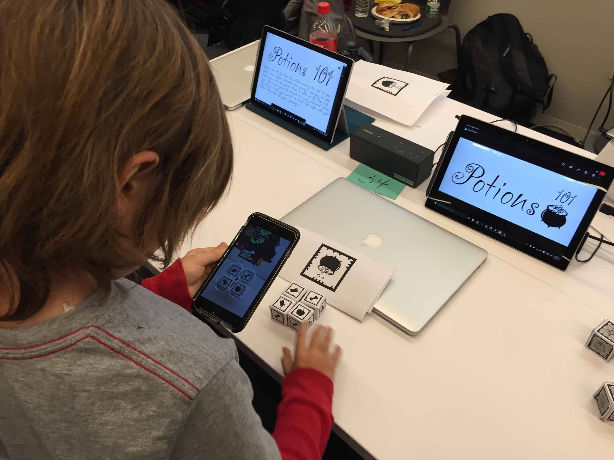
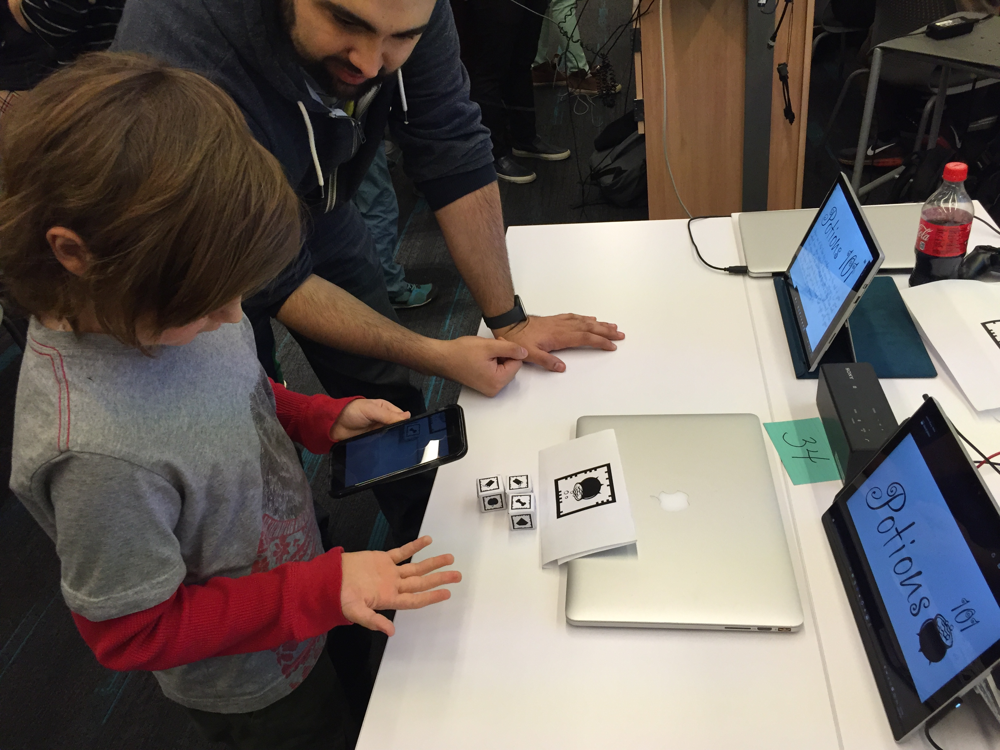
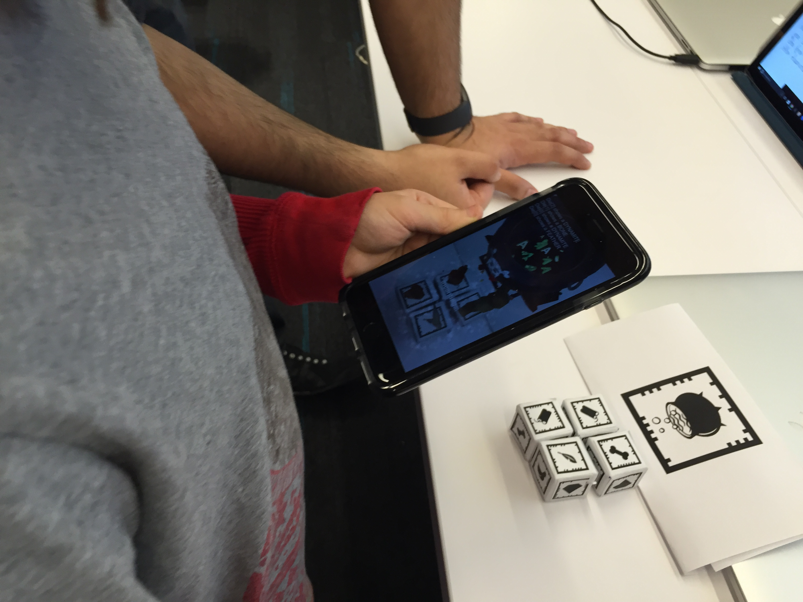
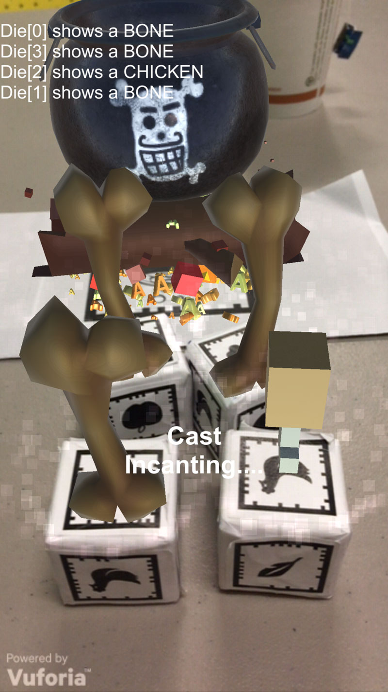

# ARGame
AR Dice Game Prototype

An augmented reality dice game created during the 2016 Global Game Jam.

<b>Goal:</b>  
Try and predict the correct ingredients needed cast your spell. The first player to cast the spell with the correct ingredients wins.

<b>Supplies</b>  
1. Print out of the Caldron (where the ingredents get added).  
2. Four dice with markers of the 6 ingredients on each side. (Marker Images included in Assets/Dice/Dice_#.png )  
3. iPhone with the Potions101 (ARGame) app on it.  

<b>Rules:</b>  
1. Roll the four dices.  
2. A player points the phone camera at the dice.  The ingredients marker labels glow. The player can re-roll any or all of the four dice once. Then attempt a cast.  
3. On a cast - If the player has all four ingredients correct - they fly out of the dice and into the caldron and that player wins. Otherwise pass the phone to the next player.  
4. The next player re-rolls one or more dice (of their choosing) and casts their own spell.   
5. Repeat until a player has guessed and rolled correctly.  
6. POWER CAST. A player has the option to power cast at the start of their turn. In a power cast they are allowed to change the dice to any ingredients they like and make a cast. If their cast is right they win, but if it's wrong the player is removed from play. So use with caution.  

 
Strategy Note: pay attention to the previous players' guesses. That's the key to winning. It's sort of like clue where each wrong guess helps eliminate some of the possibilities. 

 

http://globalgamejam.org/2016/games/potions-101-ar-game

